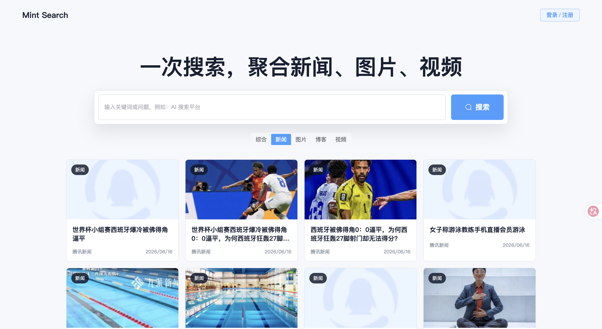
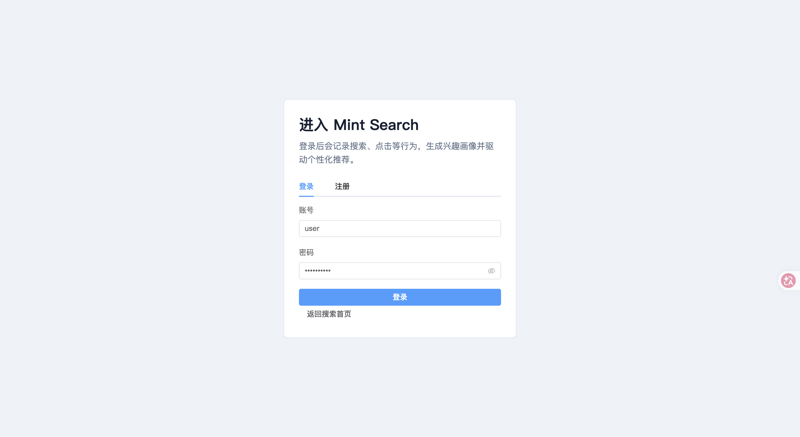
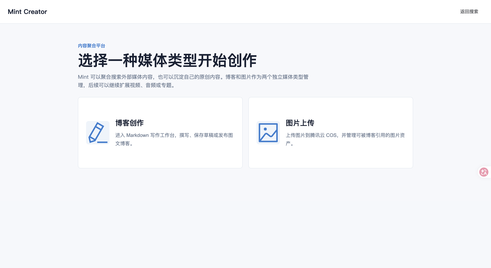
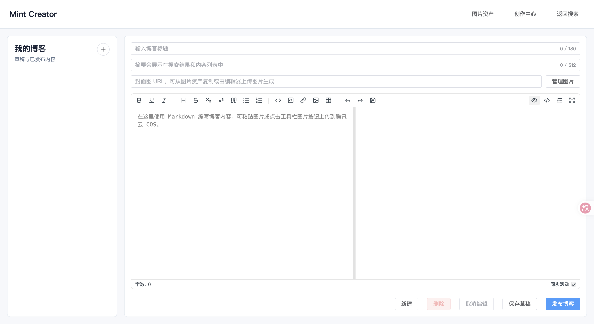
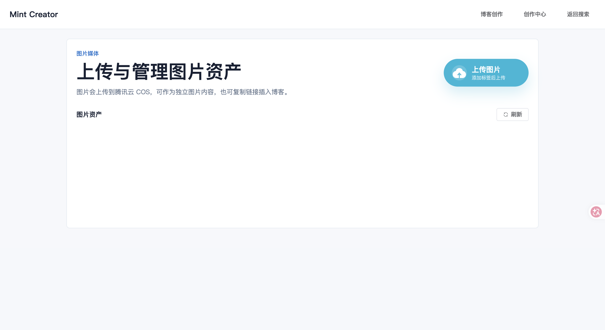
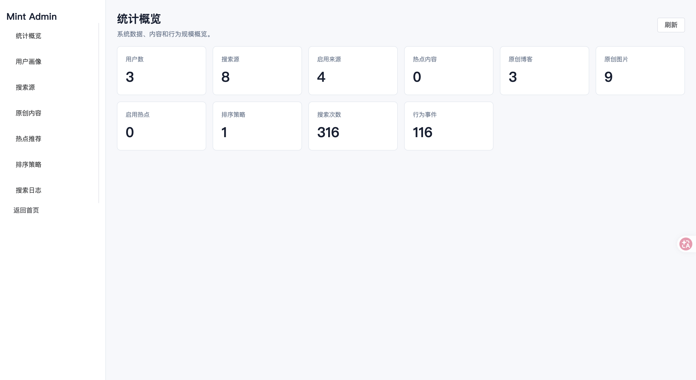
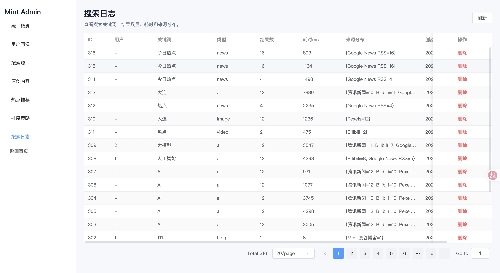
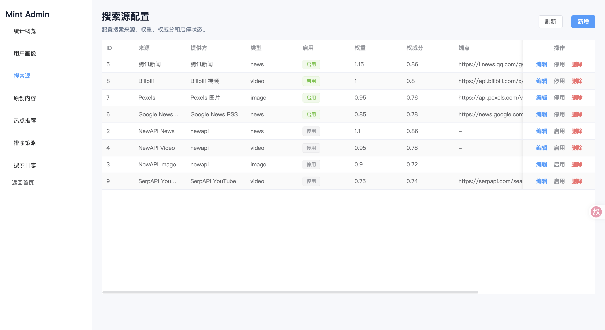
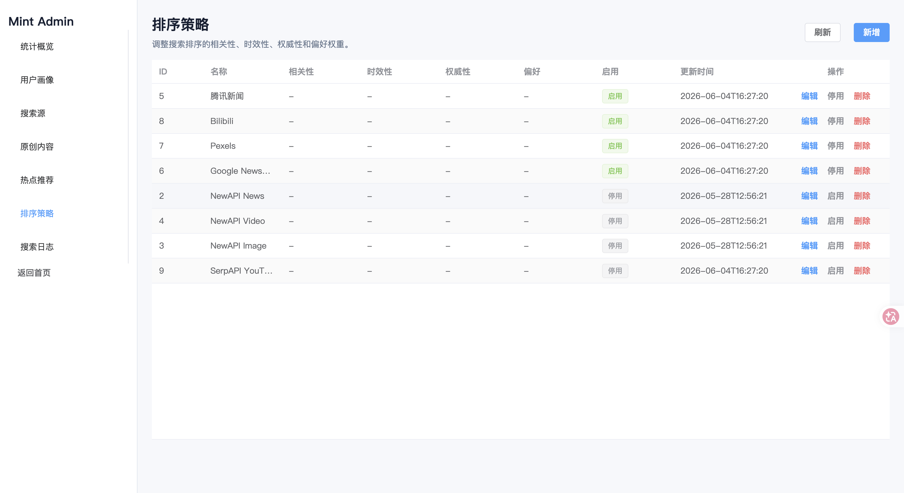
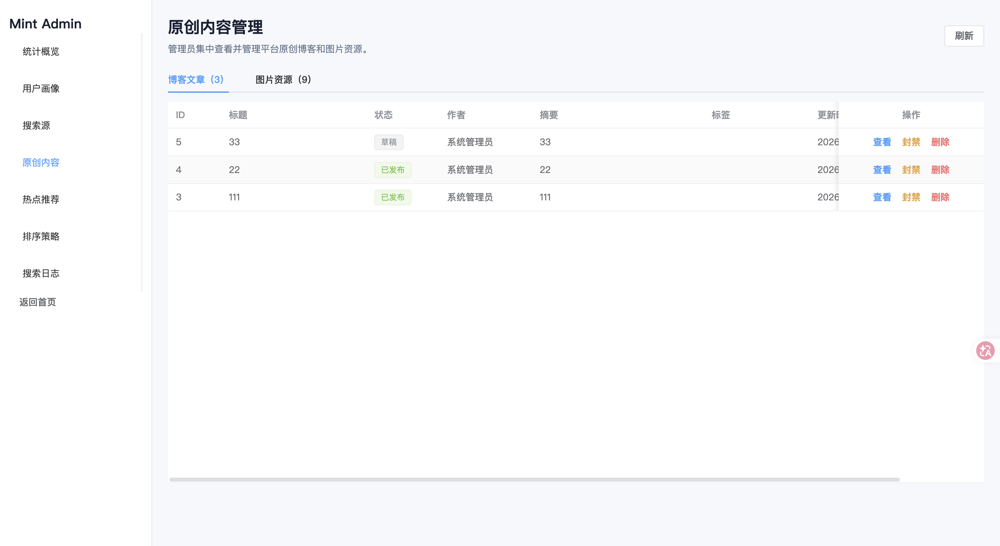

# Mint 聚合搜索平台

Mint 是一个前后端分离的 AI 驱动聚合搜索与内容推荐平台。项目面向新闻、图片、视频、博客等多类型媒体内容，提供统一检索、热点推荐、用户行为画像、个性化推荐、AI 内容分析、创作者内容管理和后台运营配置等功能。

## 项目亮点

- **多源聚合检索**：整合腾讯新闻、Google News RSS、Pexels、Bilibili、SerpAPI YouTube 等来源。
- **AI 内容分析**：接入阿里云百炼 DashScope OpenAI 兼容接口，为搜索结果生成摘要、标签和推荐理由。
- **个性化推荐**：基于用户搜索、点击行为生成兴趣画像，动态调整推荐排序。
- **智能排序配置**：支持按相关性、时效性、权威度、用户偏好配置综合排序权重。
- **创作者中心**：支持博客发布、图片上传、图片标签维护和个人内容管理。
- **后台管理**：支持用户、日志、搜索源、热点推荐、排序规则和内容审核管理。
- **稳定降级**：外部搜索源或 AI 服务未配置时，核心搜索和浏览流程仍可运行。

## 功能展示

### 首页与聚合搜索

首页提供统一搜索入口、分类切换、推荐内容和结果卡片展示，支持综合、新闻、图片、博客、视频等多类型内容检索。



图片搜索支持图片结果瀑布式展示、封面预览和来源跳转。


### 登录注册

系统提供统一登录注册入口，登录后可使用创作者中心、用户行为画像、个性化推荐和后台管理等能力。



### 创作者中心

创作者中心用于管理用户原创内容，支持博客创作、图片上传和个人内容维护。



博客创作页面支持富文本/Markdown 内容编辑、标题摘要维护和标签管理。



图片资产管理页面支持图片上传、标签维护、预览和删除。



### 后台运营管理

后台统计概览用于展示用户、搜索源、热点、排序配置、内容和行为日志等运营数据。



搜索日志页面用于查看用户检索记录，辅助分析平台使用情况和热门关键词。



搜索源配置页面用于维护新闻、图片、视频等外部数据来源及其权重、权威度和启用状态。



排序策略配置页面用于调整相关性、时效性、权威度和用户偏好等排序因子的权重。



原创内容审核页面用于管理平台内用户发布的博客、图片等原创内容，支持屏蔽和删除。



### 业务流程图

项目配套的业务流程图展示了从搜索、内容分析、行为采集到个性化推荐的整体链路。

.png>)

.png>)

.png>)

.png>)

## 技术栈

### 后端

- Java 21
- Spring Boot 3.5.12
- Spring Security + JWT
- MyBatis-Plus 3.5.9
- MySQL
- Redis
- Jackson
- Jsoup
- 腾讯云 COS SDK
- JUnit 5 / Mockito / AssertJ

### 前端

- Vue 3
- Vite 6
- Vue Router
- Pinia
- Element Plus
- Axios
- md-editor-v3

### AI 与第三方服务

- 阿里云百炼 DashScope OpenAI 兼容模式：内容摘要、标签提取、推荐理由生成。
- Pexels：图片搜索来源，可选。
- SerpAPI YouTube：视频补充来源，可选。
- 腾讯云 COS：图片对象存储，可选。

## 功能模块

### 1. 聚合搜索

首页支持按关键词检索不同类型内容：

- 综合
- 新闻
- 图片
- 博客
- 视频

后端统一聚合不同来源的数据，并通过排序服务计算综合得分。搜索结果支持封面图代理，减少跨域和防盗链导致的图片加载失败。

### 2. AI 内容预览

用户点击搜索结果后，系统会打开内容预览弹窗，并尝试调用百炼模型生成：

- 80 字以内中文摘要
- 3 到 6 个中文标签
- 一句话推荐理由

当 `BAILIAN_API_KEY` 未配置、模型响应异常或请求超时时，系统会自动使用本地兜底内容，保证预览功能可用。

核心代码：

- `backend/src/main/java/com/mint/search/content/ContentPreviewService.java`
- `backend/src/main/java/com/mint/search/content/analysis/BailianContentAnalyzer.java`
- `frontend/src/views/HomeView.vue`

### 3. 用户行为画像

平台会记录登录用户的搜索与点击行为，并更新用户画像：

- 兴趣标签：来自搜索关键词和内容标签。
- 偏好类型：来自用户点击或搜索的内容类型。
- 高意图行为：点击行为会优先影响画像顺序。

核心代码：

- `backend/src/main/java/com/mint/search/behavior/BehaviorService.java`
- `backend/src/main/java/com/mint/search/profile/UserProfile.java`

### 4. 个性化推荐

推荐接口根据用户状态采用不同策略：

- 匿名用户：返回热点推荐。
- 登录用户：结合热点、博客、图片等候选内容，基于用户画像进行个性化排序。

核心代码：

- `backend/src/main/java/com/mint/search/recommendation/RecommendationService.java`
- `backend/src/main/java/com/mint/search/search/service/RankingService.java`

### 5. 创作者中心

登录用户可以进入创作者中心：

- 发布和编辑博客
- 管理个人博客列表
- 上传图片
- 维护图片标签
- 删除个人图片资源

前端页面：

- `/creator`
- `/creator/blogs`
- `/creator/images`

### 6. 后台管理

管理员可以访问 `/admin`，管理平台运营数据：

- 用户管理
- 搜索日志
- 内容审核与屏蔽
- 搜索源配置
- 热点推荐配置
- 排序权重配置
- 数据统计看板

默认管理员账号：

```text
admin / admin123456
```

默认普通用户账号：

```text
user / user123456
```

## 项目结构

```text
mint/
├── backend/                  # Spring Boot 后端
│   ├── src/main/java/com/mint/search/
│   │   ├── admin/             # 后台管理
│   │   ├── auth/              # 登录注册与用户认证
│   │   ├── behavior/          # 用户行为采集
│   │   ├── blog/              # 博客内容管理
│   │   ├── content/           # 内容预览与 AI 分析
│   │   ├── hot/               # 热点推荐
│   │   ├── media/             # 媒体封面代理
│   │   ├── profile/           # 用户画像
│   │   ├── ranking/           # 排序配置
│   │   ├── recommendation/    # 个性化推荐
│   │   ├── search/            # 聚合搜索与排序
│   │   ├── source/            # 搜索源配置
│   │   └── upload/            # 图片上传与处理
│   └── src/main/resources/
│       ├── application.yml    # 主配置
│       └── schema.sql         # 数据库表结构
├── frontend/                  # Vue 3 前端
│   └── src/
│       ├── api/               # Axios 请求封装
│       ├── router/            # 前端路由
│       ├── stores/            # Pinia 状态
│       ├── styles/            # 全局样式
│       └── views/             # 页面视图
├── docs/                      # 项目文档
├── posters/                   # 宣传海报等展示素材
└── README.md
```

## 环境要求

- JDK 21+
- Maven 3.8+
- Node.js 18+
- MySQL 8.x
- Redis 6+

## 快速启动

### 1. 创建数据库

```sql
CREATE DATABASE IF NOT EXISTS mint_search
  DEFAULT CHARACTER SET utf8mb4
  COLLATE utf8mb4_unicode_ci;
```

后端启动时会根据 `backend/src/main/resources/schema.sql` 自动初始化表结构，并通过 `DataInitializer` 创建默认用户、搜索源和排序配置。

### 2. 配置后端环境变量

最小可运行配置：

```bash
export MYSQL_URL='jdbc:mysql://localhost:3306/mint_search?useUnicode=true&characterEncoding=utf-8&serverTimezone=Asia/Shanghai&useSSL=false&allowPublicKeyRetrieval=true'
export MYSQL_USERNAME='root'
export MYSQL_PASSWORD='12345678'
export JWT_SECRET='mint-search-local-secret'
```

AI 和第三方服务可选配置：

```bash
# 阿里云百炼，配置后启用 AI 摘要、标签和推荐理由
export BAILIAN_API_KEY='your-bailian-api-key'
export BAILIAN_MODEL='qwen-plus'
export BAILIAN_TIMEOUT_MS='5000'

# 图片搜索来源，可选
export PEXELS_API_KEY='your-pexels-api-key'

# YouTube 视频补充来源，可选
export SERPAPI_API_KEY='your-serpapi-api-key'

# 腾讯云 COS 图片存储，可选
export TENCENT_COS_BUCKET='your-bucket'
export TENCENT_COS_REGION='ap-guangzhou'
export TENCENT_COS_SECRET_ID='your-secret-id'
export TENCENT_COS_SECRET_KEY='your-secret-key'
export TENCENT_COS_CUSTOM_DOMAIN=''
```

也可以在 `backend/src/main/resources/application-local.yml` 中写入本地私有配置。该文件会被 `application.yml` 自动加载，适合保存本机数据库密码和 API Key。

### 3. 启动后端

```bash
cd backend
mvn spring-boot:run
```

默认后端地址：

```text
http://localhost:8080
```

### 4. 启动前端

```bash
cd frontend
npm install
npm run dev
```

默认前端地址：

```text
http://localhost:5173
```

如果后端不是 `http://localhost:8080`，可以设置：

```bash
export VITE_API_BASE_URL='http://127.0.0.1:8081'
npm run dev
```

## 

## AI 模块说明

AI 内容分析使用百炼 OpenAI 兼容 Chat Completions 接口，配置前缀为 `bailian`：

```yaml
bailian:
  base-url: ${BAILIAN_BASE_URL:https://dashscope.aliyuncs.com/compatible-mode/v1}
  api-key: ${BAILIAN_API_KEY:}
  model: ${BAILIAN_MODEL:qwen-plus}
  timeout-ms: ${BAILIAN_TIMEOUT_MS:5000}
```

模型被要求返回严格 JSON：

```json
{
  "summary": "80字以内中文摘要",
  "tags": ["标签1", "标签2", "标签3"],
  "recommendReason": "一句话说明推荐理由"
}
```

完整规格说明可查看：

[docs/AI相关模块详细规格说明书.md](docs/AI相关模块详细规格说明书.md)

## 常见问题

### 1. 后端启动后搜索结果为空

检查网络连接和搜索源配置。部分第三方来源需要 API Key，例如 Pexels 和 SerpAPI。腾讯新闻、Google News RSS、Bilibili 不需要额外密钥，但可能受网络环境影响。

### 2. AI 摘要没有出现

确认已经配置 `BAILIAN_API_KEY`。如果未配置，系统会自动使用本地兜底内容，页面仍可正常预览。

### 3. 图片或视频封面不显示

项目已提供 `/api/media/thumbnail` 代理接口，用于缓解跨域、防盗链和 WebP 兼容问题。若仍无法显示，检查后端服务地址是否与前端 `VITE_API_BASE_URL` 一致。

### 4. 前端请求失败

检查前端配置的 API 地址：

```bash
export VITE_API_BASE_URL='http://localhost:8080'
```

如果后端运行在 `8081`，需要同步改为：

```bash
export VITE_API_BASE_URL='http://127.0.0.1:8081'
```

### 5. 数据库连接失败

确认 MySQL 已启动，并检查：

- 数据库 `mint_search` 是否存在。
- `MYSQL_USERNAME` 和 `MYSQL_PASSWORD` 是否正确。
- JDBC URL 中是否包含 `allowPublicKeyRetrieval=true`。

## 项目文档与展示素材

- [Mint聚合搜索平台](docs/Mint聚合搜索平台_实训报告.docx)

- [AI 相关模块详细规格说明书](docs/AI相关模块详细规格说明书.md)
- [产品宣传海报](posters/Mint聚合搜索平台_产品宣传海报_v2.png)

## 说明

本项目为 AI 驱动的企业级聚合搜索平台实训原型，重点展示前后端分离开发、聚合检索、AI 内容理解、个性化推荐、用户画像和后台运营配置等能力。生产环境部署时，建议进一步补充接口限流、日志监控、AI 调用缓存、对象存储权限控制和敏感内容审核。
