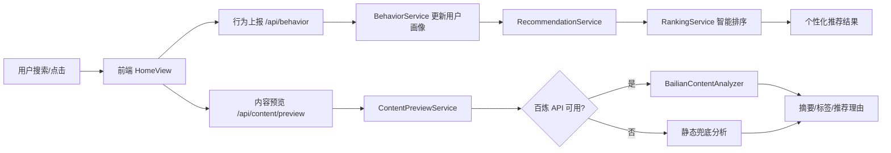

# Mint 聚合搜索平台 AI 相关模块详细规格说明书

## 1. 文档概述

### 1.1 编写目的

本文档面向 Mint 聚合搜索平台中已经实现的 AI 与智能化能力，说明模块边界、功能设计、技术选型、接口定义、核心实现逻辑、异常降级策略和后续优化方向。文档可作为课程实训报告、项目验收材料、后续二次开发和测试设计的依据。

### 1.2 模块范围

当前项目中的 AI 相关能力分为两类：

1. 生成式 AI 能力：通过阿里云百炼 DashScope 的 OpenAI 兼容接口，对搜索结果进行内容摘要、标签提取和推荐理由生成。
2. 智能化算法能力：通过用户行为画像、可配置排序权重、个性化推荐规则，实现面向不同用户的内容重排与推荐。

本文档覆盖以下模块：

- 百炼内容分析模块
- 内容预览与 AI 推荐理由模块
- 用户行为采集与用户画像模块
- 个性化推荐模块
- 搜索结果智能排序模块
- 排序权重后台配置模块

当前项目尚未实现向量检索、Embedding 相似度召回、深度学习推荐模型训练、AI 内容审核拦截和流式大模型输出。上述能力在本文档的“后续扩展”中作为优化方向说明，不作为当前已实现功能描述。

## 2. AI 模块总体设计

### 2.1 设计目标

AI 相关模块的总体目标是提升聚合搜索平台的结果理解能力和个性化推荐体验：

- 对搜索结果进行自动摘要，降低用户阅读成本。
- 为内容生成标签，帮助用户快速判断主题。
- 结合用户行为形成兴趣画像，让推荐结果更贴近用户偏好。
- 通过可配置排序权重控制相关性、时效性、权威度和偏好分的占比。
- 在大模型不可用时提供稳定兜底，保证核心搜索与浏览流程不受影响。

### 2.2 总体流程

用户在前端执行搜索或点击内容后，系统会记录行为数据。点击搜索结果时，前端请求内容预览接口，后端尝试调用百炼大模型生成摘要、标签和推荐理由。如果模型调用失败或未配置密钥，系统返回静态兜底分析内容。

推荐接口根据用户登录状态采用不同策略：匿名用户返回热点内容；登录用户基于 `user_profile` 中的兴趣标签和偏好类型，对候选内容进行个性化打分并排序。



## 3. 技术选型

### 3.1 后端技术栈

| 技术 | 版本/实现 | 用途 |
| --- | --- | --- |
| Java | 21 | 后端主开发语言 |
| Spring Boot | 3.5.12 | REST API、依赖注入、安全认证、配置管理 |
| Spring Web `RestClient` | Spring Boot 内置 | 调用百炼 OpenAI 兼容接口 |
| Spring Security + JWT | JJWT 0.12.6 | 登录认证、用户身份解析、行为接口鉴权 |
| MyBatis-Plus | 3.5.9 | 数据表实体映射、CRUD、逻辑删除 |
| MySQL | 8.x 兼容 | 存储用户行为、画像、排序配置、内容数据 |
| Redis | Spring Data Redis | 缓存与后续热点能力扩展 |
| Jackson | Spring Boot 内置 | 大模型 JSON 响应解析 |
| JUnit 5 / Mockito / AssertJ | Spring Boot Test | 单元测试与服务逻辑验证 |

### 3.2 前端技术栈

| 技术 | 版本/实现 | 用途 |
| --- | --- | --- |
| Vue 3 | 3.5.13 | 前端页面与组件开发 |
| Vite | 6.1.0 | 前端开发服务器与构建 |
| Element Plus | 2.9.10 | UI 组件库 |
| Pinia | 3.0.2 | 用户登录态与全局状态管理 |
| Axios | 1.9.0 | HTTP 请求封装 |

### 3.3 AI 服务选型

当前项目选用阿里云百炼 DashScope，并通过 OpenAI 兼容模式调用 Chat Completions 接口。

选型理由：

- 接口兼容 OpenAI Chat Completions 协议，后续切换模型供应商成本较低。
- 默认模型为 `qwen-plus`，适合中文摘要、标签提取、推荐理由生成等文本理解任务。
- 通过配置项控制 `base-url`、`api-key`、`model` 和超时时间，便于不同环境部署。
- 使用低温度参数 `temperature=0.2`，减少输出随机性，提高 JSON 结构稳定性。

配置项位于 `backend/src/main/resources/application.yml`：

```yaml
bailian:
  base-url: ${BAILIAN_BASE_URL:https://dashscope.aliyuncs.com/compatible-mode/v1}
  api-key: ${BAILIAN_API_KEY:}
  model: ${BAILIAN_MODEL:qwen-plus}
  timeout-ms: ${BAILIAN_TIMEOUT_MS:5000}
```

## 4. 功能模块规格

### 4.1 百炼内容分析模块

#### 4.1.1 功能说明

百炼内容分析模块负责对单条搜索结果进行智能分析，输出结构化结果：

- `summary`：80 字以内中文摘要。
- `tags`：3 到 6 个中文标签。
- `recommendReason`：一句话推荐理由。
- `enhanced`：标识结果是否由大模型增强生成。

该模块用于提升内容预览页的可读性，让用户无需打开原站点即可了解内容重点。

#### 4.1.2 输入输出

输入对象为 `SearchItemDto`，主要字段包括：

- `title`：搜索结果标题。
- `summary`：搜索结果摘要。
- `type`：内容类型，如 news、image、video、blog。
- `sourceName`：来源名称。
- `tags`：已有标签。
- `url`：原文链接。
- `thumbnailUrl`：封面图链接。

输出对象为 `ContentAnalysisResult`：

| 字段 | 类型 | 说明 |
| --- | --- | --- |
| `summary` | String | AI 生成或兜底生成的摘要 |
| `tags` | List<String> | AI 提取或兜底生成的标签 |
| `recommendReason` | String | 推荐理由 |
| `enhanced` | boolean | 是否为大模型增强结果 |

#### 4.1.3 核心实现

核心类：

- `backend/src/main/java/com/mint/search/content/analysis/ContentAnalyzer.java`
- `backend/src/main/java/com/mint/search/content/analysis/BailianContentAnalyzer.java`
- `backend/src/main/java/com/mint/search/content/analysis/BailianProperties.java`
- `backend/src/main/java/com/mint/search/content/analysis/ContentAnalysisResult.java`

`BailianContentAnalyzer` 的实现步骤：

1. 校验输入内容和 `BAILIAN_API_KEY`。如果搜索结果为空或未配置密钥，直接返回 `Optional.empty()`。
2. 使用 `RestClient` 构造 HTTP 客户端，设置 Bearer Token、JSON 请求头、连接超时和读取超时。
3. 组装 Chat Completions 请求，包含 system prompt 和 user prompt。
4. 要求模型只返回可解析 JSON，避免输出自然语言解释。
5. 从 `choices[0].message.content` 中提取模型文本。
6. 清理 Markdown 代码块标记，例如 ```json。
7. 使用 Jackson 解析 JSON，提取 `summary`、`tags` 和 `recommendReason`。
8. 对标签去重、去空、限长，最多保留 8 个。
9. 解析成功时返回 `enhanced=true`，失败时返回 `Optional.empty()` 交给上层兜底。

请求结构示例：

```json
{
  "model": "qwen-plus",
  "temperature": 0.2,
  "messages": [
    {
      "role": "system",
      "content": "你是 Mint 聚合搜索平台的内容分析助手，只返回可解析 JSON。"
    },
    {
      "role": "user",
      "content": "请分析以下搜索结果，返回严格 JSON：..."
    }
  ]
}
```

模型期望返回结构：

```json
{
  "summary": "80字以内中文摘要",
  "tags": ["人工智能", "搜索平台", "推荐系统"],
  "recommendReason": "该内容与当前检索主题高度相关，适合作为优先阅读结果。"
}
```

### 4.2 内容预览与 AI 推荐理由模块

#### 4.2.1 功能说明

内容预览模块为前端搜索结果卡片提供详情预览能力。用户点击结果后，前端弹出预览窗口，展示标题、来源、缩略图、摘要、推荐理由和标签。若百炼分析成功，页面显示“百炼分析”标识。

#### 4.2.2 接口定义

接口路径：

```http
POST /api/content/preview
```

控制器：

```java
ContentPreviewController.preview(ContentPreviewRequest request)
```

请求体：

```json
{
  "item": {
    "id": "news-001",
    "title": "AI 搜索平台发展趋势",
    "summary": "本文介绍 AI 搜索平台的发展方向。",
    "type": "news",
    "sourceName": "腾讯新闻",
    "tags": ["AI", "搜索"],
    "url": "https://example.com/news/001",
    "thumbnailUrl": "https://example.com/thumb.jpg"
  }
}
```

响应体核心字段：

| 字段 | 类型 | 说明 |
| --- | --- | --- |
| `title` | String | 内容标题 |
| `type` | String | 内容类型 |
| `sourceName` | String | 来源名称 |
| `originalUrl` | String | 原文链接 |
| `thumbnailUrl` | String | 封面图 |
| `content` | String | 预览正文 |
| `analysisSummary` | String | AI 或兜底摘要 |
| `analysisTags` | List<String> | AI 或兜底标签 |
| `recommendReason` | String | 推荐理由 |
| `llmEnhanced` | boolean | 是否由大模型增强 |

#### 4.2.3 具体实现

核心类：

- `backend/src/main/java/com/mint/search/content/ContentPreviewController.java`
- `backend/src/main/java/com/mint/search/content/ContentPreviewService.java`
- `backend/src/main/java/com/mint/search/content/ContentPreviewRequest.java`
- `backend/src/main/java/com/mint/search/content/ContentPreviewResponse.java`

实现逻辑：

1. 前端在用户点击搜索结果时，调用 `/api/content/preview`。
2. `ContentPreviewService` 从 `ContentPreviewRequest.item` 中读取搜索结果信息。
3. 服务调用 `ContentAnalyzer.analyze(item)` 尝试进行百炼分析。
4. 如果返回 `ContentAnalysisResult`，使用大模型摘要、标签和推荐理由。
5. 如果返回空，使用本地兜底摘要、标签和默认推荐理由。
6. 将结果组装为 `ContentPreviewResponse` 返回前端。

兜底推荐理由为：

```text
该内容在当前检索结果中结合了关键词相关性、发布时间、来源权威度和用户偏好等信号进行排序。
```

前端实现位于 `frontend/src/views/HomeView.vue`，主要交互包括：

- 点击搜索结果后打开预览弹窗。
- 先记录 `CLICK` 行为，再调用内容预览接口。
- 根据 `preview.llmEnhanced` 展示“百炼分析”标识。
- 展示 `analysisSummary`、`recommendReason` 和 `analysisTags`。

### 4.3 用户行为采集与用户画像模块

#### 4.3.1 功能说明

用户行为采集模块用于记录用户在平台内的搜索和点击行为，并将行为转化为用户画像。用户画像用于后续个性化推荐和搜索结果重排。

当前支持的行为类型包括：

- `SEARCH`：用户执行搜索。
- `CLICK`：用户点击某条搜索结果或推荐内容。

点击行为被视为更高意图，会优先影响用户兴趣标签和内容类型偏好。

#### 4.3.2 接口定义

接口路径：

```http
POST /api/behavior
```

该接口需要用户登录，后端通过认证信息获取当前用户 ID。

请求体：

```json
{
  "eventType": "CLICK",
  "keyword": "AI 搜索平台",
  "itemId": "news-001",
  "itemType": "news",
  "tags": ["人工智能", "搜索平台"],
  "durationSeconds": 1
}
```

#### 4.3.3 数据表设计

行为记录表：`user_behavior`

| 字段 | 说明 |
| --- | --- |
| `id` | 主键 |
| `user_id` | 用户 ID |
| `event_type` | 行为类型 |
| `keyword` | 搜索关键词 |
| `item_id` | 内容 ID |
| `item_type` | 内容类型 |
| `tags` | 内容标签 |
| `duration_seconds` | 停留时长 |
| `deleted` | 逻辑删除标记 |
| `create_time` | 创建时间 |

用户画像表：`user_profile`

| 字段 | 说明 |
| --- | --- |
| `id` | 主键 |
| `user_id` | 用户 ID |
| `interest_tags` | 兴趣标签，逗号分隔 |
| `preferred_types` | 偏好内容类型，逗号分隔 |
| `deleted` | 逻辑删除标记 |
| `create_time` | 创建时间 |
| `update_time` | 更新时间 |

#### 4.3.4 具体实现

核心类：

- `backend/src/main/java/com/mint/search/behavior/BehaviorController.java`
- `backend/src/main/java/com/mint/search/behavior/BehaviorService.java`
- `backend/src/main/java/com/mint/search/behavior/BehaviorRequest.java`
- `backend/src/main/java/com/mint/search/behavior/UserBehavior.java`
- `backend/src/main/java/com/mint/search/profile/UserProfile.java`

处理流程：

1. 前端在搜索时上报 `SEARCH` 行为，在点击结果时上报 `CLICK` 行为。
2. `BehaviorController` 从当前登录用户中获取 `userId`。
3. `BehaviorService.record()` 保存一条 `UserBehavior`。
4. `BehaviorService.refreshProfile()` 读取行为中的关键词、标签和内容类型。
5. 使用 `LinkedHashSet` 合并历史画像和新行为特征，实现去重并保留顺序。
6. 对 `CLICK` 行为，新标签和类型优先放在前面，体现高意图行为。
7. 用户画像字段最多保留 12 个标签或类型，避免画像无限增长。

该模块属于轻量级用户画像实现，不依赖离线训练任务，适合课程实训和中小规模原型系统。

### 4.4 个性化推荐模块

#### 4.4.1 功能说明

个性化推荐模块根据用户登录状态和用户画像返回首页推荐内容。

推荐策略：

- 匿名用户：直接返回热点内容，最多 12 条。
- 登录用户：读取用户画像，将热点、博客、图片等候选内容合并后进行个性化评分，返回分数最高的 12 条。

#### 4.4.2 接口定义

接口路径：

```http
GET /api/recommendations?type=all
```

可选类型：

- `all`
- `news`
- `image`
- `video`
- `blog`

#### 4.4.3 具体实现

核心类：

- `backend/src/main/java/com/mint/search/recommendation/RecommendationController.java`
- `backend/src/main/java/com/mint/search/recommendation/RecommendationService.java`
- `backend/src/main/java/com/mint/search/search/service/RankingService.java`

实现逻辑：

1. 判断当前请求是否携带登录用户身份。
2. 未登录时，调用 `HotDataService.getHotData(type)` 返回热点内容。
3. 已登录时，读取 `UserProfile` 中的 `interestTags` 和 `preferredTypes`。
4. 根据推荐类型组装候选集：
   - `all/news/video`：热点数据。
   - `all/blog`：用户博客内容。
   - `all/image`：用户上传图片内容。
5. 将用户偏好类型转换为权重映射：
   - 排名越靠前的类型权重越高。
   - 权重计算使用 `max(1.15, 1.9 - index * 0.15)`。
6. 调用 `RankingService.rank()` 进行基础排序。
7. 在基础分上叠加个性化分：
   - 类型偏好命中加权。
   - 兴趣标签命中加权。
8. 按 `personalizedScore` 降序返回前 12 条。

个性化分计算规则：

| 分值项 | 说明 |
| --- | --- |
| 原始排序分 | 搜索排序服务输出的综合分 |
| 类型偏好分 | 内容类型命中用户 `preferredTypes` 时加分 |
| 标签兴趣分 | 标题、摘要或标签中包含用户兴趣标签时加分，每个命中标签加 0.55 |

### 4.5 搜索结果智能排序模块

#### 4.5.1 功能说明

搜索结果智能排序模块将多源搜索结果统一转换为可比较分数，解决不同来源、不同内容类型之间排序标准不一致的问题。

排序维度包括：

- 相关性：内容与搜索关键词的匹配程度。
- 时效性：发布时间距离当前时间越近，分数越高。
- 权威度：内容来源的可信度评分。
- 用户偏好：内容类型是否符合用户偏好。
- 来源权重：搜索源自身配置的权重。

#### 4.5.2 排序公式

综合分计算公式：

```text
score = (relevance * relevanceWeight
       + freshness * freshnessWeight
       + authority * authorityWeight
       + preference * preferenceWeight
       + typeBoost) * sourceWeight
```

默认权重：

| 权重项 | 默认值 |
| --- | --- |
| 相关性 `relevanceWeight` | 0.45 |
| 时效性 `freshnessWeight` | 0.20 |
| 权威度 `authorityWeight` | 0.25 |
| 用户偏好 `preferenceWeight` | 0.10 |

#### 4.5.3 具体实现

核心类：

- `backend/src/main/java/com/mint/search/search/service/RankingService.java`
- `backend/src/main/java/com/mint/search/ranking/RankingConfig.java`
- `backend/src/main/java/com/mint/search/ranking/mapper/RankingConfigMapper.java`

实现规则：

1. 优先从数据库读取启用的 `RankingConfig`。
2. 如果数据库没有启用配置，使用内置兜底权重。
3. 相关性根据关键词 token 是否出现在标题、摘要和标签中计算。
4. 时效性根据发布时间计算：
   - 24 小时内：1.0
   - 7 天内：0.75
   - 30 天内：0.5
   - 更早：0.25
5. 权威度来自搜索源配置或内容自身评分。
6. 用户偏好分来自用户画像中的内容类型偏好。
7. 请求指定类型且内容类型命中时，增加 `typeBoost=0.3`。
8. 最终按综合分降序排序。

### 4.6 排序权重后台配置模块

#### 4.6.1 功能说明

后台管理端支持查看、新增、修改和删除排序权重配置。管理员可以调整不同排序因子的占比，从而影响搜索结果和推荐内容排序。

#### 4.6.2 接口定义

接口前缀：

```http
/api/admin/ranking
```

接口列表：

| 方法 | 路径 | 功能 |
| --- | --- | --- |
| GET | `/api/admin/ranking` | 查询排序配置列表 |
| POST | `/api/admin/ranking` | 新建排序配置 |
| PUT | `/api/admin/ranking/{id}` | 更新排序配置 |
| DELETE | `/api/admin/ranking/{id}` | 删除排序配置 |

#### 4.6.3 配置校验

`AdminService.normalizeRanking()` 负责配置校验：

- 配置名称不能为空。
- 未传权重时使用默认值。
- 每个权重限制在 `0.0` 到 `1.0`。
- 相关性、时效性、权威度、偏好四个权重总和必须约等于 `1`，允许 `0.01` 的误差。
- `enabled` 只允许归一化为 `1` 或 `0`。

默认排序配置由 `DataInitializer.createRankingConfig()` 初始化：

```text
名称：默认综合排序
相关性：0.45
时效性：0.20
权威度：0.25
用户偏好：0.10
启用：是
```

## 5. 关键数据结构

### 5.1 内容分析结果

```java
public record ContentAnalysisResult(
        String summary,
        List<String> tags,
        String recommendReason,
        boolean enhanced
) {}
```

### 5.2 内容预览响应

```java
public class ContentPreviewResponse {
    private String title;
    private String type;
    private String sourceName;
    private String originalUrl;
    private String thumbnailUrl;
    private String content;
    private String analysisSummary;
    private List<String> analysisTags;
    private String recommendReason;
    private boolean llmEnhanced;
}
```

### 5.3 排序配置

```java
public class RankingConfig {
    private Long id;
    private String name;
    private Double relevanceWeight;
    private Double freshnessWeight;
    private Double authorityWeight;
    private Double preferenceWeight;
    private Integer enabled;
    private Integer deleted;
    private LocalDateTime createTime;
    private LocalDateTime updateTime;
}
```

## 6. 前后端交互流程

### 6.1 搜索行为流程

1. 用户在首页输入关键词并点击搜索。
2. 前端调用 `/api/search` 获取聚合搜索结果。
3. 如果用户已登录，前端调用 `/api/behavior` 上报 `SEARCH` 行为。
4. 后端保存行为记录并更新用户画像。
5. 后续推荐接口读取画像进行个性化排序。

### 6.2 点击预览流程

1. 用户点击某条搜索结果。
2. 前端调用 `/api/behavior` 上报 `CLICK` 行为。
3. 前端调用 `/api/content/preview` 获取内容预览。
4. 后端调用百炼内容分析模块。
5. 模型调用成功则返回 AI 摘要、标签和推荐理由。
6. 模型调用失败或未配置密钥则返回本地兜底内容。
7. 前端根据 `llmEnhanced` 展示是否为百炼增强分析。

### 6.3 推荐刷新流程

1. 首页加载时调用 `/api/recommendations`。
2. 匿名用户返回热点推荐。
3. 登录用户读取画像后进行候选召回和个性化排序。
4. 用户点击推荐内容后继续反馈行为数据，形成闭环。

## 7. 异常处理与降级策略

### 7.1 百炼 API 未配置

当 `BAILIAN_API_KEY` 为空时，`BailianContentAnalyzer` 不发起外部请求，直接返回空结果。`ContentPreviewService` 使用本地兜底摘要与推荐理由。

### 7.2 大模型响应格式异常

如果模型未返回合法 JSON，或 JSON 字段缺失、解析失败，分析器返回 `Optional.empty()`。上层继续使用兜底内容，避免接口失败影响用户浏览。

### 7.3 外部接口超时

百炼接口超时时间由 `BAILIAN_TIMEOUT_MS` 控制，默认 5000ms。超时异常被捕获后降级处理，保证内容预览接口可用。

### 7.4 用户未登录

行为上报接口需要登录；推荐接口允许匿名访问。匿名用户不会写入用户画像，只返回热点推荐。

### 7.5 排序配置缺失

如果数据库中没有启用的排序配置，`RankingService` 使用内置默认权重，保证排序功能正常运行。

## 8. 安全与隐私设计

1. 百炼 API Key 通过环境变量 `BAILIAN_API_KEY` 注入，不应提交到代码仓库。
2. 用户行为接口通过 JWT 识别用户身份，避免伪造他人画像。
3. 用户画像只保存兴趣标签和偏好类型，不保存敏感个人信息。
4. 大模型分析只发送搜索结果标题、摘要、类型、来源和标签等必要字段，减少不必要的数据外传。
5. 后台排序配置接口归属于管理端能力，应仅允许管理员操作。

## 9. 测试设计

### 9.1 已覆盖测试

当前项目中与 AI/智能化模块相关的测试包括：

- `BailianContentAnalyzerTest`
  - 验证 OpenAI 兼容 JSON 响应可以正确解析。
  - 验证模型返回非 JSON 内容时能够安全降级。
- `RecommendationServiceTest`
  - 验证匿名用户返回热点推荐。
  - 验证热点为空时返回空结果。
  - 验证博客类型不会错误回退到新闻。
  - 验证不同用户画像会导致推荐排序变化。
- `BehaviorServiceTest`
  - 验证点击行为会刷新兴趣标签。
  - 验证偏好类型会被合并并保留高意图顺序。

### 9.2 建议补充测试

- 百炼接口超时降级测试。
- `BAILIAN_API_KEY` 为空时不发起 HTTP 请求测试。
- `ContentPreviewService` 的 AI 成功和兜底路径测试。
- `RankingService` 各权重组合下的排序稳定性测试。
- 后台排序权重总和校验测试。
- 前端预览弹窗对 `llmEnhanced=true/false` 的展示测试。

## 10. 部署配置说明

### 10.1 必要环境变量

```bash
MYSQL_URL=jdbc:mysql://localhost:3306/mint_search?useUnicode=true&characterEncoding=utf-8&serverTimezone=Asia/Shanghai&useSSL=false&allowPublicKeyRetrieval=true
MYSQL_USERNAME=root
MYSQL_PASSWORD=12345678
JWT_SECRET=your-jwt-secret
BAILIAN_API_KEY=your-bailian-api-key
BAILIAN_MODEL=qwen-plus
BAILIAN_TIMEOUT_MS=5000
```

### 10.2 启动方式

后端：

```bash
cd backend
mvn spring-boot:run
```

前端：

```bash
cd frontend
npm install
npm run dev
```

## 11. 模块限制与后续优化方向

### 11.1 当前限制

1. 百炼内容分析为同步调用，用户点击预览时需要等待模型响应。
2. AI 分析结果没有持久化缓存，同一内容重复点击可能重复调用模型。
3. 推荐算法以规则评分为主，没有引入协同过滤、向量召回或深度学习模型。
4. 用户画像仅基于标签和内容类型，尚未建模长期兴趣衰减。
5. 模型异常目前以静默降级为主，缺少详细可观测日志和调用统计。
6. 尚未实现 Prompt 注入检测、AI 内容审核和敏感内容拦截。

### 11.2 后续优化

1. 增加 AI 分析缓存表，将 `itemId`、模型版本、摘要、标签和推荐理由持久化。
2. 将百炼分析改为异步任务，首次返回兜底内容，分析完成后刷新缓存。
3. 引入 Embedding 模型，将搜索结果、博客和图片描述写入向量库，支持语义召回。
4. 为用户画像增加时间衰减机制，近期行为权重高于历史行为。
5. 增加模型调用日志，统计成功率、耗时、Token 消耗和失败原因。
6. 对 Prompt 输入进行长度限制和注入风险过滤。
7. 引入 A/B 测试能力，对不同排序权重和推荐策略进行效果评估。
8. 增加后台 AI 配置页面，支持模型、温度、超时时间和提示词模板动态调整。

## 12. 结论

Mint 聚合搜索平台当前已经形成了完整的 AI 增强闭环：搜索结果进入平台后，系统通过百炼大模型生成内容摘要、标签和推荐理由；用户搜索与点击行为被记录为画像；推荐服务再根据画像和排序权重进行个性化重排。该设计兼顾了生成式 AI 能力和传统规则推荐的稳定性，在模型不可用时仍能保持系统可用，适合作为企业级 AI 搜索与推荐系统的实训原型。
